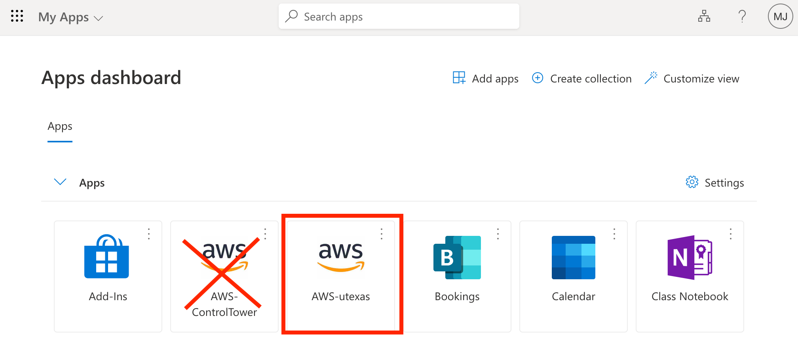

# Connect to AWS S3

You will use S3 buckets to upload data from your lab to share internally within WCWH.

## 1. Login with UT EID and password
Go to https://myapplications.microsoft.com, sign in if required, and search for 
"AWS-utexas." Click that icon and you will be redirected to the AWS access portal. 
If you want to bookmark a link, I recommend this one: https://utexas.awsapps.com/start

## 2. AWS access portal page
The AWS access portal page has an orange icon. Select the label "VRES-WCWH-Cohort" 
and then the "COLAITS-S3-faculty-name" link.

## 3. AWS console page
Now you are signed into AWS and are on the main console landing page. You will see 
that many things are disabled for you. Use the search bar at the top left to search 
for "S3." 

 

## 4. Create a shortcut to S3
Click the star icon to create a shortcut to the S3 console page and then select
the S3 option.

## 5. Main S3 Screen
You are now at the main S3 screen. You will have access to an S3 bucket or buckets 
with the name of your lab in the following format:

**wcwh-data-prod-cohort-faculty-name**

Use the search bar to quickly find the bucket you are looking for. Make sure you 
choose the bucket with the prefix **wcwh-data-prod-**. Some lab groups will have 
multiple buckets. You will only be able to access the S3 bucket for your lab.

## 6. Select bucket for your lab
Select the bucket for your lab and use the orange **Upload** button to upload your 
data files. You will have the option to use a drag/drop operation or a file browser 
for the upload process. I manage encryption for all WCWH buckets centrally, so you 
don't need to try to change any bucket settings.

## A few things to keep in mind
- Please do not put anything into the folder named “processed_data_for_database” 
before meeting with Joe Midura (joseph.midura@austin.utexas.edu). Labs will use 
that particular folder to add records to a database visible by everyone within WCWH. 
You can still create folders and upload other data, though.
- I encrypted all WCWH S3 buckets so you don't need to try to change bucket settings.
- You will only be able to access your own lab’s S3 bucket.

Please contact Joe Midura (joseph.midura@austin.utexas.edu) if you have any questions.

\
